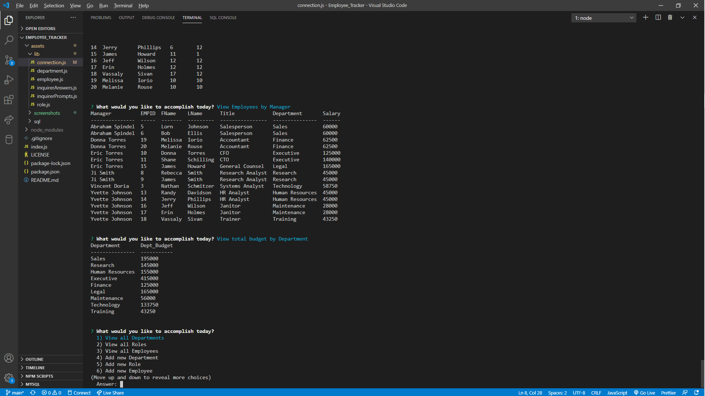

# Employee Tracker

## Project Description

This application utilizes the MySQL tools to create relational databases.  There is a "company" database, with tables for "department", "role", and "employee".  The role table has a department_id field to identify which department the role belongs.  The employee table has a role_id to identify which role the employee belongs and through the relational database also which department.  The [inquirer npm library](https://www.npmjs.com/package/inquirer) is used to give a command line interface.  The [console.table npm library](https://www.npmjs.com/package/console.table) is used to help organize infromation in the terminal.

## Table of Contents

* [Title](#project-title)
* [Description](#project-description)
* [Table of Contents](#table-of-contents)
* [Installation](#installation-instructions)
* [Usage](#usage)
* [Contributing](#guidelines-for-contributing)
* [Tests](#tests)
* [Technologies](#technologies-used)
* [Author](#author)
* [Questions](#questions)
* [License](#license)

## Installation Instructions

Clone this repository.  Open the file in an IDE.

## Usage 

Use this project to create, read, update, and delete (CRUD) your own database fields.  Users can expand upon the relational database provided, or they can create their own information to manage.

Here are two :movie_camera: **VIDEOS** :movie_camera: that display how to use the application.

1. *CODE* walk through:

2. *PROMPTS* walk through:

## Guidelines for Contributing

Please feel free to contact me at the e-mail listed below with any suggestions for additional features or improvements on existing ones.

## Tests

Test early; test often.

### Technologies Used 
### :computer: :computer: :computer: :computer: :computer: :computer: 

#### :memo: HTML5 :memo:

**HTML5** is a markup language used for structuring and presenting content on the World Wide Web.  The goals are to improve the language with support for the latest multi-media and other new features; to keep the language both easily readable by humans and consistently understood by computers and devices; and to remain backward compatible to older software.  Many new symantec features are included.

*HTML5* content borrowed from <a target="_blank" rel="noopener noreferrer">[this page](https://en.wikipedia.org/wiki/HTML5).</a>

#### :art: CSS :art:

**Cascading Style Sheets (CSS)** is a stylesheet language used for describing the presentation of a document written in a markup language (such as HTML5).  CSS is designed to enable the separation of presentation and content; including layout, colors, and fonts.  This separation improves content accessibility to provide more flexibility and control in the specification of presentation characteristics, enabling multiple web pages to share formatting by specifying relevant CSS in a separate file, which reduces complexity and repetition in the structural content (HTML), as well as enabling the file to be cached to improve the page load speed between the pages that share the file and its formatting.

Separation of formatting and content also makes it feasible to present the same markup page in different styles for different rendering methods, such as on-screen, in print, by voice, and on Braille-based tactile devices. 

*CSS* content borrowed from <a target="_blank" rel="noopener noreferrer">[this page](https://en.wikipedia.org/wiki/Cascading_Style_Sheets).</a>

#### :shoe: Bootstrap 4 :shoe:

**Bootstrap 4** is a free and open-source CSS framework directed at responsive, mobile-first front-end web development.  It contains CSS and (optionally) JavaScript-based design templates for typography, forms, buttons, navigation, and other interface components.  

*Bootstrap 4* content borrowed from <a target="_blank" rel="noopener noreferrer">[this page](https://en.wikipedia.org/wiki/Bootstrap_(front-end_framework)).</a>

#### :sparkler: JavaScript :sparkler:

**JavaScript (JS)** is one of the core technologies of the World Wide Web (along with HTML and CSS). It enables interactive web pages and is an essential part of web applications.  JS is a multi-faceted, scripting language that provides versatility through Application Programming Interfaces (APIs) and Document Object Model (DOM) manipulation, among others.

*JavaScript* content borrowed from <a target="_blank" rel="noopener noreferrer">[this page](https://en.wikipedia.org/wiki/JavaScript).</a>

#### :globe_with_meridians: NODE.js :globe_with_meridians:

**NODE.js** is an open-source, cross-platform JavaScript runtime environment that execute JavaScript code outside a web browser.  NODE.js lets developers use JavaScript to write command line tools and for server-side scripting.  NODE.js represents a "Javascript everywhere" paradigm, unifying web-application development around a single programming language, rather than different programming languages for server- and client-side scripts.  

*NODE.js* content borrowed from <a target="_blank" rel="noopener noreferrer">[this page](https://en.wikipedia.org/wiki/Node.js).

[Download Node.js](https://nodejs.org/en/).

#### :card_index: MySQL :card_index:

**MySQL** is an open-source relational database management system(RDBMS). A relational database organizes data into one or more data tables.  SQL is a language programmers use to create, modify, and extract data from the relational database, as well as control access to the database.

*MySQL* content borrowed from <a target="_blank" rel="noopener noreferrer">[this page](https://en.wikipedia.org/wiki/MySQL).</a>

[Download MySQL](https://dev.mysql.com/downloads/mysql).

### Author 

This *Employee Tracker* was built by :green_heart: Eric D. Torres :green_heart:

## Questions

Check out my [GitHub profile](https://github.com/etorres-revature).

You can contact me by e-mail at etorresnotary@gmail.com for any additional questions and/ or clarifications you may need about the project.

##### License

[This application uses the **MIT License** found here](./LICENSE).

**[This README.md file generated with my NODE.js README Generator app.](https://github.com/etorres-revature/NODEjs_README.md_Generator)**
